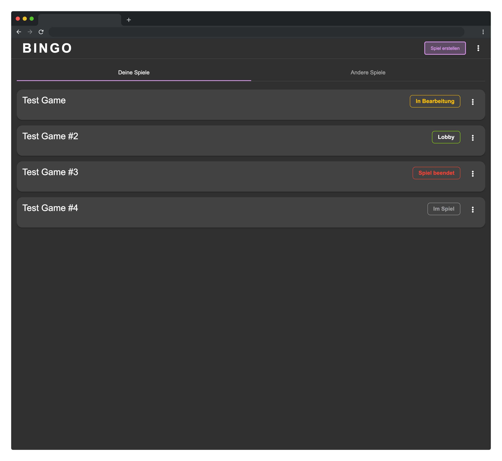
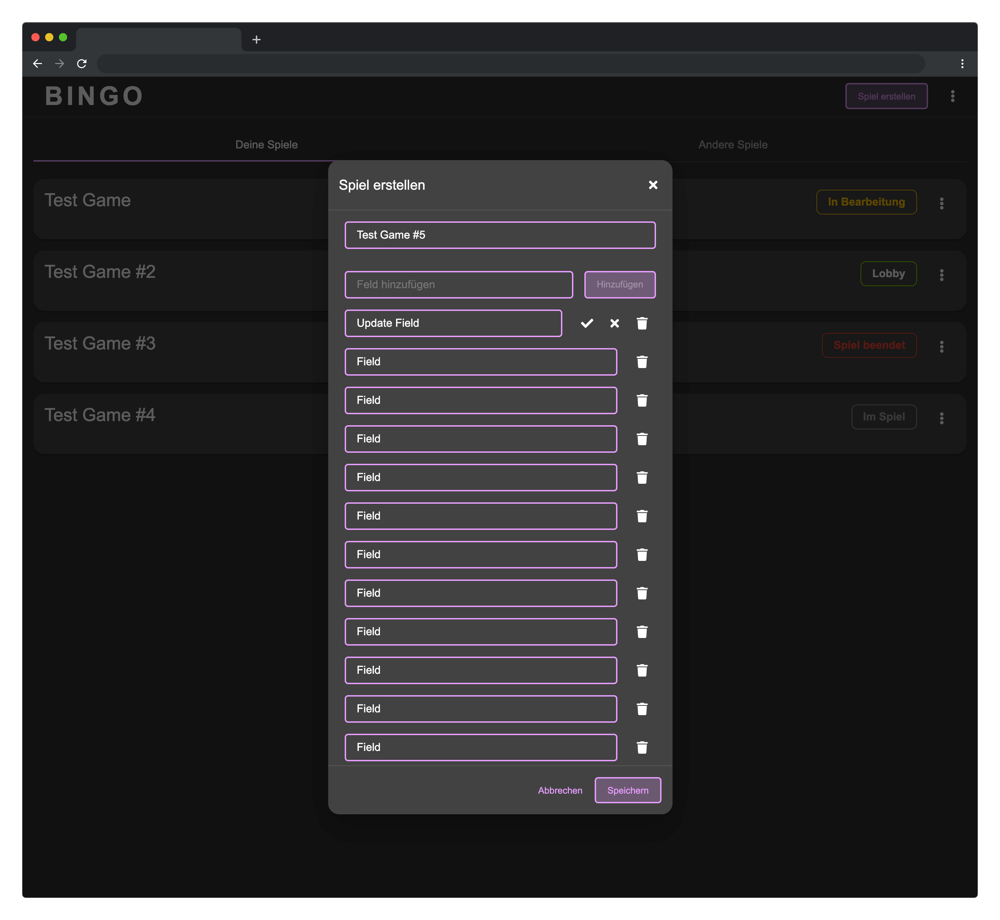
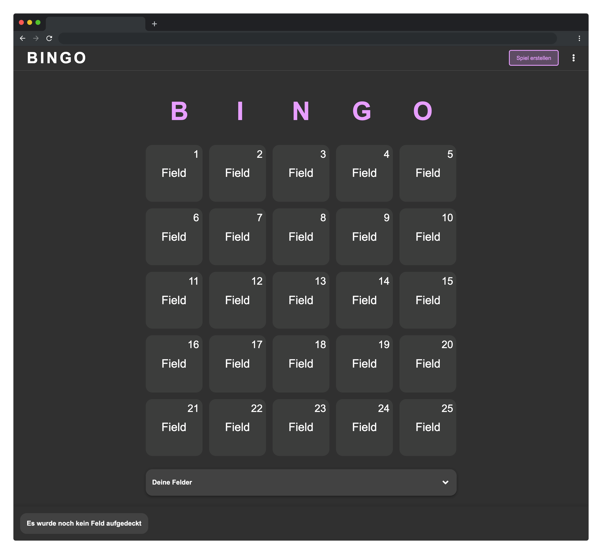
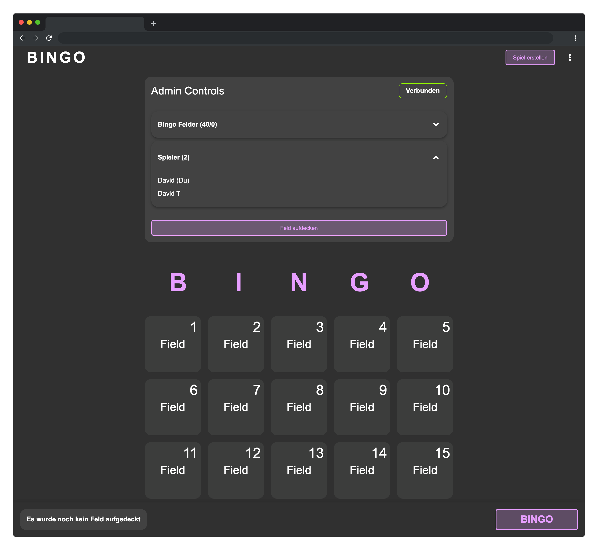

<center>
  
</center>

# Table of contents

- [Members](#Members)
- [Abstract](#Abstract)
- [Getting Started](#Getting-Started)
- [Project Structure](#Project-Structure)
- [Tests](#Tests)
- [Migrations](#Migrations)
- [CI/CD](#CI/CD)
- [Common Commands](#Common-Commands)
  - [Backend](#Backend)
  - [Frontend](#Frontend)

# Members

- Sundar Arz (sa070)
- Fabian Bekemeier (fb084)
- Yannik Pfeifer (yp009)
- Maximilian Staudenmaier (ms497)
- David Tomschitz (dt035)

# Abstract

# Getting Started & Installation

## Locally

In order to run the different apps the repository obvisously needs to get clone and the required packages must be installed via `npm install`. Besides that [MongoDB](https://www.mongodb.com/), [Deno](https://deno.land/) and [NodeJS](https://nodejs.org/) are required in order to start the backend and frontend.

```bash
$ git clone git@gitlab.mi.hdm-stuttgart.de:mwa/ss21/saturn.git
$ cd saturn
$ npm install
$ npm run backend:cache

$ npm install -g nx
```

## Docker

Further more the whole project can be started and run with `docker-compose up` which should be the preferred way to the run the whole project. This elimates the requirement to install the node modules locally as well as the global [Nrwl Nx](https://nx.dev/), [Deno](https://deno.land/), [MongoDB](https://www.mongodb.com/) and [NodeJS](https://nodejs.org/) installation.

**For more detailed informations about how to start the frontend and backend take a look into the [Common Commands](#Common-Commands) section.**

# Project Structure

The entire project is divided into different folders to ensure a generally clear structure. In order to achieve this goal [Nrwl Nx](https://nx.dev/) is used, which helps to architect, test, and build the applications and libraries. Additionally `Nx` enables us to manage the frontend and backend in a single workspace and share libraries accross each without any effort. The basic structure of the project is thus partially specified by `Nx` an looks as follows:

- **Apps:** The source, most of the configuration files as well as the unit and integration tests of the the frontend and backend are stored inside the `apps` folder. Both applications are divided into the equally named folders `frontend` and `backend`.
- **Libraries:** The `libs` folder contains everything that is shared across the frontend and backend (eg. the Interfaces and the GraphQL Mutations/Queries)
- **Tools:** The `tools` folder contains the `wait-for` script for our docker-compose setup as well as some database migrations which we used along the development.

# Tests

In the final state of the project, there are unit and integration tests for the backend and frontend. Those can be started either locally via `npm run backend:test` or `npm run frontend:test` or in a docker container by executing `docker-compose run backend ./test.sh` or `docker-compose run frontend ./test.sh`.

# Migrations

In order to create persistent migrations for our database, we used [migrate-mongo](https://github.com/seppevs/migrate-mongo) which is a migration tool for [MongoDB](https://www.mongodb.com/). The tool is installed if the `$ npm install` command has been run earlier. With the intention to migrate between the different migrations inside the `tools/migrations` folder, the commands `$ npm run database:migrate:up` and `$ npm run database:migrate:down` can be used. The former command can be used to run every migration that wasn`t already applyied to the database. On the opposite, the command `database:migrate:down` will only roll back the last applied migration.

# CI/CD

# Common Commands

| Name                    | Description                                                      |
| ----------------------- | ---------------------------------------------------------------- |
| _backend:start_         | Starts the backend in development mode                           |
| _backend:test_          | Runs the tests for the backend                                   |
| _backend:cache_         | Downloads and caches the required Deno modules                   |
| _backend:lint_          | Lints the backend                                                |
| _frontend:start_        | Starts the frontend in development mode                          |
| _frontend:test_         | Runs the tests for the frontend                                  |
| _frontend:lint_         | Lints the frontend                                               |
| _database:migrate:up_   | Runs every migration that wasn't already applyied to the databse |
| _database:migrate:down_ | Rolls back the latest applyied migration                         |

# Screenshots







Icon made by Freepik from www.flaticon.com
